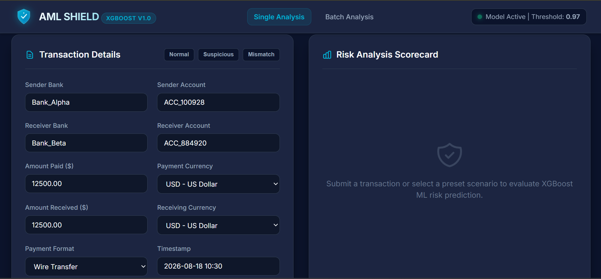
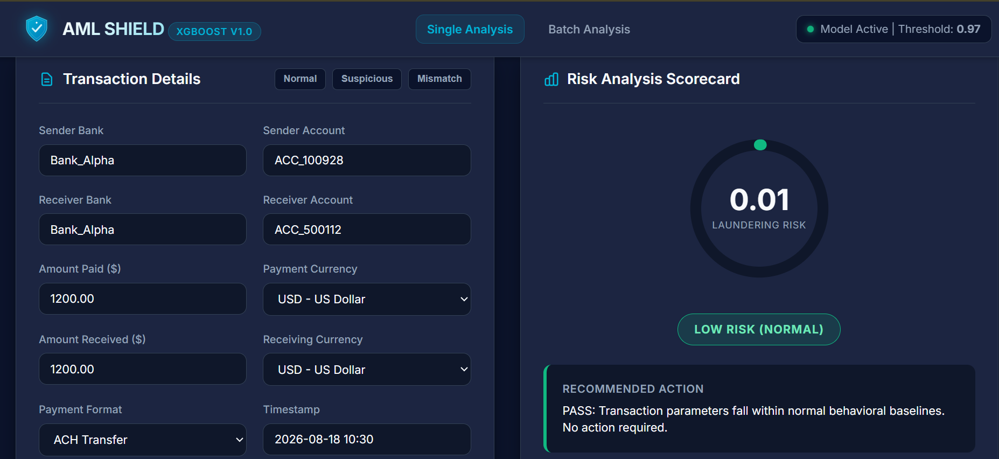
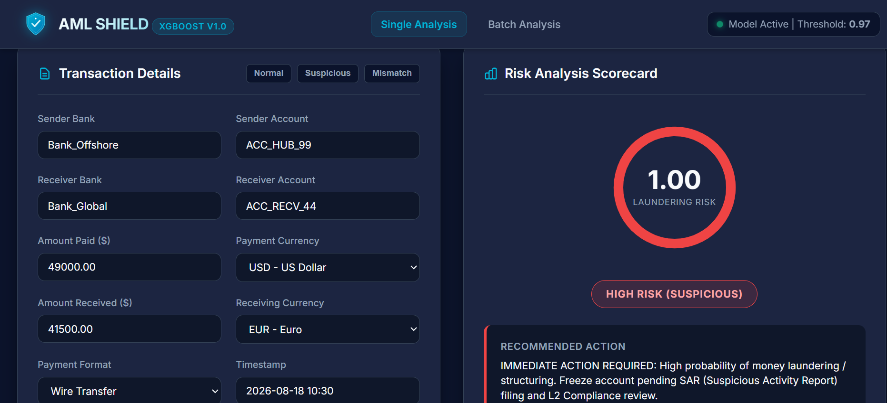
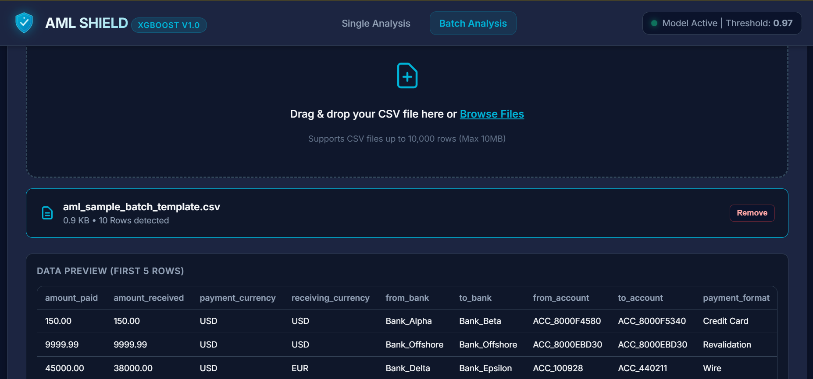
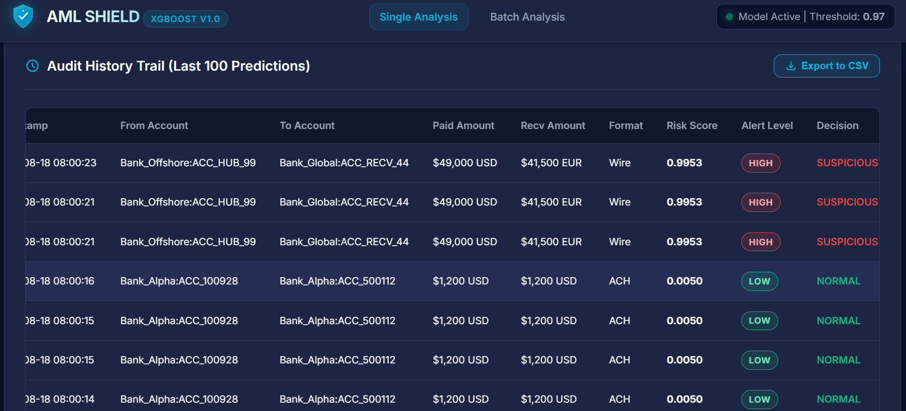

# 🛡️ AML Shield - Suspicious Transaction Detection

[](https://www.python.org/)
[](https://flask.palletsprojects.com/)
[](https://xgboost.readthedocs.io/)
[](https://www.docker.com/)
[](LICENSE)

This is my Cyber Talent Center (CTC) project. AML Shield is a web app that uses an XGBoost model to flag transactions that look like money laundering. The model was trained on the IBM AML dataset — 5.07 million transactions — using 56 features, a mix of basic transaction stuff (amount, currency, whether it crossed banks) and graph features that look at how accounts connect to each other (fan-in/out, cycles, how fast money moves through an account).

🌐 Live demo: [https://aml-suspicious-transaction-detection.onrender.com](https://aml-suspicious-transaction-detection.onrender.com)
📁 Repo: [https://github.com/Nathenael11/AML-Suspicious-Transaction-Detection](https://github.com/Nathenael11/AML-Suspicious-Transaction-Detection)

(Heads up — it's hosted on Render's free tier, so if nobody's used it in a while the first request takes 30-60 seconds to spin the server back up. Not broken, just cold-starting.)

---

## What it does

- Submit a single transaction and get a risk score back instantly
- Upload a CSV for batch analysis
- Risk score shown as a gauge (0-1), not just a raw number
- Keeps a history of the last 100 predictions with timestamps
- Export prediction history to CSV
- Dark navy/teal UI

## Screenshots

### Dashboard


### Normal transaction (low risk)


### Suspicious transaction (high risk)


### Batch upload


### Audit history


---

## Results

Split chronologically into train/val/test — I didn't shuffle randomly, since that would let the model train on transactions from the "future" relative to what it's predicting, which isn't realistic. Everything below is on the held-out test set, a chunk the model never touched during training.

| Metric | Baseline | Full model (graph features) | Relative improvement |
|--------|----------|-------------------------------|-------------------------|
| PR-AUC | 0.0133 | 0.1180 | +787% |
| F1 | 0.0376 | 0.1828 | +386% |
| Precision | 3.4% | 14.6% | +329% |
| Recall | 4.2% | 24.5% | +483% |
| Top-100 precision | — | 36% | — |
| Dataset size | 5.07M | 5.07M | — |
| Positive rate | 0.1% | 0.1% | — |

So in practice: about 1 in 7 flagged transactions is actually laundering, and the model catches roughly 1 in 4 of the real cases. Out of the 100 accounts it ranks as riskiest, 36 turn out to be confirmed launderers.

Those numbers probably look low if you're used to seeing 90%+ accuracy thrown around, so it's worth explaining why. Less than 0.1% of the transactions in this dataset are actually illicit, which means accuracy is a useless metric here — a model that just says "not laundering" every single time would be right over 99.9% of the time and would catch literally nothing. PR-AUC and F1 are what actually matter at this kind of imbalance, and numbers in this range line up with what gets reported in the papers this dataset is from, not just my own run.

The baseline model only sees transaction-level stuff — amount, currency, timestamp, that kind of thing. The full model adds the graph features on top. The jump between the two columns is basically the whole point of the project: a single transaction rarely looks suspicious by itself, but the pattern around the account usually does.

---

## Architecture

```
User → Web Dashboard → Flask API → Feature Engineering (56 features) → XGBoost Model → Risk Score
```

---

## Running it locally

```bash
git clone https://github.com/Nathenael11/AML-Suspicious-Transaction-Detection.git
cd aml-webapp
pip install -r requirements.txt
python run.py
```

Then go to `http://localhost:5000`.

### With Docker

```bash
docker build -t aml-shield .
docker run -p 5000:5000 aml-shield
```

---

## Project structure

```
aml-webapp/
├── app/                     # Flask backend (routes, models, feature engineering)
│   ├── __init__.py
│   ├── routes.py
│   ├── models.py
│   ├── utils.py
│   └── feature_engineering.py
├── static/                  # CSS, JS, logo
│   ├── css/
│   ├── js/
│   └── img/
├── templates/                # HTML dashboard
│   └── index.html
├── models/                   # Trained XGBoost model files
│   ├── model.pkl
│   └── feature_names.pkl
├── tests/                     # Unit tests
│   └── test_app.py
├── images/                   # Screenshots for this README
│   ├── dashboard.png
│   ├── normal.png
│   ├── suspicious.png
│   ├── batch.png
│   └── audit.png
├── AML_Suspicious_Transaction_Detection.ipynb   # training notebook
├── run.py
├── requirements.txt
├── Dockerfile
├── docker-compose.yml
├── deploy.sh
├── .github/workflows/          # CI/CD
├── LICENSE
└── README.md
```

## Tests

```bash
pytest tests/
```

## API

| Endpoint | Method | What it does |
|---|---|---|
| `/` | GET | dashboard |
| `/predict` | POST | score a single transaction |
| `/api/history` | GET | last 100 predictions |
| `/export-csv` | GET | download prediction history |
| `/health` | GET | service/model health check |

## Stack

- **Backend:** Python, Flask, Werkzeug, Gunicorn
- **ML:** XGBoost, scikit-learn, pandas, NumPy
- **Frontend:** HTML, CSS, vanilla JS
- **DevOps:** Docker, Docker Compose, GitHub Actions
- **Hosting:** Render
- **Testing:** Pytest

---

## Things this doesn't do well

Being honest about where this falls short, since it's a student project, not something I'd actually trust to run compliance for a bank:

- It's only trained on the HI-Small version of the IBM dataset. There's a lower-illicit-ratio variant too, and I'd expect performance to drop on that one — that seems to be a known property of this dataset, not something specific to my pipeline.
- Cycle detection has a length limit and a degree cap so it actually finishes running in reasonable time. That means longer or weirder laundering chains can slip past it.
- At this precision, you'd still want a person reviewing anything flagged — this isn't accurate enough to act on by itself.

---

## License

MIT — see [LICENSE](LICENSE).

## Thanks

- IBM, for putting the AML dataset together
- The XGBoost and Flask teams
- Mr. Mikiyas Tadesse, my course mentor, for the guidance throughout

## Author

**Nathenael Ermias**
CTC Program Project — AML Suspicious Transaction Detection

📧 nathenaelermias13@gmail.com
🔗 [github.com/Nathenael11](https://github.com/Nathenael11)
🌐 [Live demo](https://aml-suspicious-transaction-detection.onrender.com)

If this was useful to you, a star on the repo is appreciated.

© 2026 Nathenael Ermias
